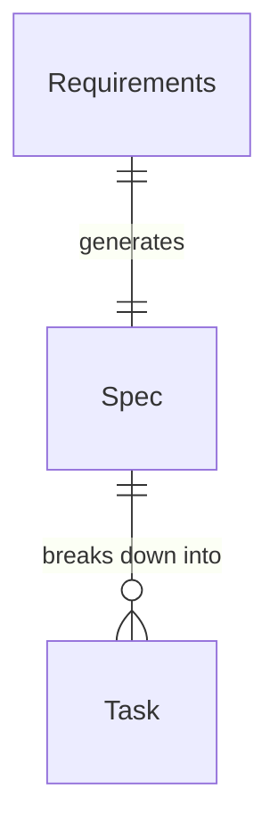
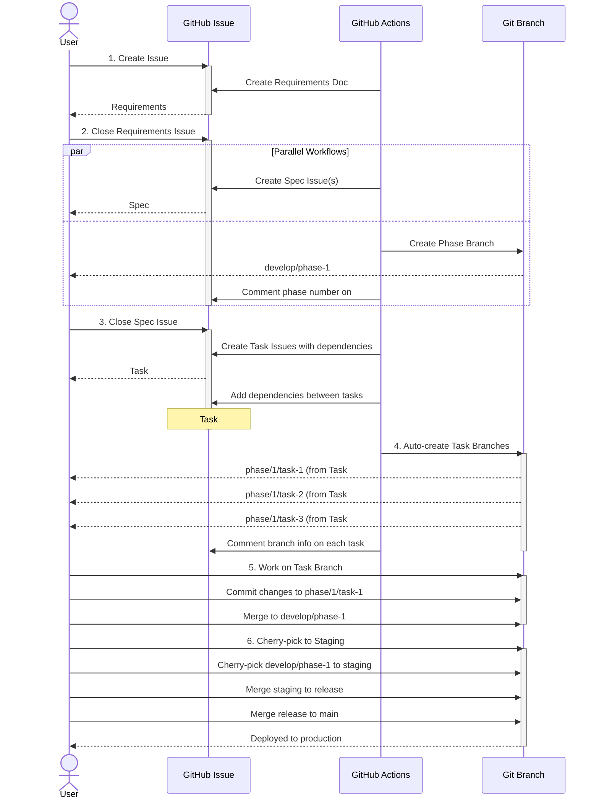

# Github Codex Workflow

AI workflow that can be completed entirely within the GitHub browser @codex

## Document Workflow

### Document Relationship



### Lifecycle Sequence Diagram



### Workflow Automation

1. **Create Requirements** ([`.github/workflows/create-requirements.yml`](.github/workflows/create-requirements.yml))
   - **Trigger**: Issue opened
   - **Action**: Generate requirements document with AI
   - **Labels**: `doc-type:requirements`, `doc-state:draft`

2. **Create Spec** ([`.github/workflows/create-spec.yml`](.github/workflows/create-spec.yml))
   - **Trigger**: Requirements issue closed with labels `doc-type:requirements` + `doc-state:draft`
   - **Action**: Generate specification document(s) as new issue(s) with AI
   - **Labels**: `doc-type:spec`, `doc-state:draft`
   - **Updates**: Requirements issue label → `doc-state:completed`

3. **Create Phase Branch** ([`.github/workflows/create-phase-branch.yml`](.github/workflows/create-phase-branch.yml))
   - **Trigger**: Requirements issue closed with labels `doc-type:requirements` + `doc-state:draft`
   - **Action**: Create `develop/phase-{N}` branch with sequential numbering
   - **Comment**: Posts phase number to Requirements issue
   - **Branch created**: `develop/phase-1`, `develop/phase-2`, etc.

4. **Create Tasks** ([`.github/workflows/create-tasks.yml`](.github/workflows/create-tasks.yml))
   - **Trigger**: Spec issue closed with labels `doc-type:spec` + `doc-state:draft`
   - **Action**:
     - Generate task issue(s) with AI following **1 task = 1 file** principle
     - Identify and set dependencies between tasks
     - Add task dependencies using GitHub API (`addBlockedByDependency`)
   - **Labels**: `doc-type:task`, `task-state:todo`
   - **Updates**: Spec issue label → `doc-state:completed`

5. **Create Task Branch** ([`.github/workflows/create-task-branch.yml`](.github/workflows/create-task-branch.yml))
   - **Trigger**: Task issue opened with label `doc-type:task`
   - **Action**: Create `phase/{N}/task-{M}` branch with sequential numbering per phase
   - **Comment**: Posts phase and task numbers to Task issue
   - **Branch created**: `phase/1/task-1`, `phase/1/task-2`, etc.

6. **Execute Task** ([`.github/workflows/execute-task.yml`](.github/workflows/execute-task.yml))
   - **Trigger**: Comment on task issue starting with `/execute`
   - **Action**:
     - **Check dependencies**: Verify all dependency tasks are completed
     - If blocked: Comment with list of blocking tasks and exit
     - If ready: Checkout task branch, generate implementation code using AI
     - Commit and push changes to task branch
     - Update task status to `in-progress`
   - **Usage**: Comment `/execute <additional instructions>` on task issue

7. **Review Task** ([`.github/workflows/review-task.yml`](.github/workflows/review-task.yml))
   - **Trigger**: Comment on task issue starting with `/review`
   - **Conditions**: Task must be `task-state:in-progress`
   - **Action**:
     - Compare task branch changes against phase branch
     - AI reviews code for correctness, quality, security, performance
     - Posts review feedback with issues and suggestions
     - Adds label: `review:approved` or `review:changes-requested`
   - **Usage**: Comment `/review` on task issue after implementation

8. **Create Pull Request** ([`.github/workflows/create-pr.yml`](.github/workflows/create-pr.yml))
   - **Trigger**: Comment on task issue starting with `/create-pr`
   - **Conditions**: Task must have `review:approved` label
   - **Action**:
     - Creates PR from task branch to phase branch
     - Includes task reference and change summary
     - Posts PR link to task issue
   - **Usage**: Comment `/create-pr` after review approval

9. **Review Pull Request** ([`.github/workflows/review-pr.yml`](.github/workflows/review-pr.yml))
   - **Trigger**: Pull request opened or updated
   - **Action**:
     - AI reviews all PR changes
     - Posts comprehensive review with strengths, issues, suggestions
     - Provides recommendation: APPROVE / REQUEST CHANGES / COMMENT
   - **Automatic**: Runs on all PRs

10. **Auto-Fix Task** ([`.github/workflows/auto-fix-task.yml`](.github/workflows/auto-fix-task.yml))
    - **Trigger**: Comment on task issue starting with `/auto-fix`
    - **Conditions**: Task has `review:changes-requested` label
    - **Action**:
      - Read review feedback from comments
      - AI fixes code based on review suggestions
      - Commit and push fixes to task branch
      - Auto-trigger `/review` for re-review
    - **Automatic**: Triggered when review fails

11. **Auto-Complete on PR Merge** ([`.github/workflows/auto-complete-on-merge.yml`](.github/workflows/auto-complete-on-merge.yml))
    - **Trigger**: Pull request merged
    - **Conditions**: PR has `doc-type:task` label
    - **Action**:
      - Find task issue from "Closes #N" in PR body
      - Auto-post `/complete` comment to task issue
    - **Automatic**: Runs when PR is merged

12. **Complete Task** ([`.github/workflows/complete-task.yml`](.github/workflows/complete-task.yml))
    - **Trigger**: Comment on task issue starting with `/complete`
    - **Action**:
      - Close the task issue and mark as `task-state:done`
      - Find all tasks that depend on this task
      - Remove dependency relationships using `removeDependencyBlockedBy`
      - Check if dependent tasks have all dependencies completed
      - Auto-execute ready tasks by posting `/execute` comment
    - **Usage**: Comment `/complete` after PR is merged (or auto-triggered)
    - **Parallel execution**: Automatically triggers next available tasks

13. **Update Documents** ([`.github/workflows/update-requirements.yml`](.github/workflows/update-requirements.yml), [`.github/workflows/update-spec.yml`](.github/workflows/update-spec.yml))
   - **Trigger**: Comment added to issue with appropriate labels
   - **Action**: Update document based on comment using AI
   - **Conditions**:
     - Requirements: `doc-type:requirements` + `doc-state:draft`
     - Spec: `doc-type:spec` + `doc-state:draft`

### Task Design Principles

**1 Task = 1 File Principle:**
- Each task modifies or creates exactly ONE file
- Promotes parallel work without conflicts
- Clear responsibility and review scope
- Dependencies ensure proper execution order

**Example Task Breakdown:**
```
Feature: User Authentication
├─ Task 1: Install auth packages (package.json)
├─ Task 2: Implement auth logic (src/auth.ts) - depends on Task 1
├─ Task 3: Implement user model (src/models/user.ts) - depends on Task 1
├─ Task 4: Create auth middleware (src/middleware/auth.ts) - depends on Task 2, 3
└─ Task 5: Add auth tests (src/auth.test.ts) - depends on Task 2, 4
```

**Dependency Management & Parallel Execution:**
- Tasks can be worked on in parallel if no dependencies
- Tasks with dependencies are blocked until prerequisite tasks complete
- GitHub Issue dependencies visualize the task graph
- **Automatic parallel execution**:
  1. When a task is completed (`/complete`), the workflow finds dependent tasks
  2. Removes the dependency relationship using `removeDependencyBlockedBy`
  3. Checks if dependent tasks have all their dependencies completed
  4. Automatically executes ready tasks by posting `/execute` comment
  5. Multiple independent tasks can execute in parallel

**Complete Task Lifecycle (Fully Automated):**
```
1. Task Created (task-state:todo)
   ↓
2. AUTO: /execute → Implementation (AI generates code)
   ↓
3. AUTO: /review → Code Review (AI reviews changes)
   ↓
   ├─ ✅ review:approved → AUTO: /create-pr → Continue to step 4
   └─ ⚠️ review:changes-requested → AUTO: /auto-fix → Re-review (loop until approved)
   ↓
4. AUTO: Pull Request Created
   ↓
5. AUTO: PR Auto-Review (AI reviews PR)
   ↓
6. MANUAL: Human Review & Merge PR ← Only manual step!
   ↓
7. AUTO: /complete → Task Done (task-state:done) + Trigger dependent tasks
   ↓
8. AUTO: Dependent tasks execute in parallel (repeat from step 2)
```

**Key Features:**
- ✅ **Fully Automated**: Everything except PR merge runs automatically
- ✅ **Self-Healing**: Auto-fixes code when review fails
- ✅ **Parallel Execution**: Independent tasks run simultaneously
- ✅ **Human-in-the-Loop**: Only PR merge requires human approval

**Parallel Execution Example:**
```
Spec Complete
  ↓
Task 1 (no deps) → AUTO: execute → review → fix (if needed) → PR → MANUAL MERGE → complete
Task 2 (depends on 1) → waits...
Task 3 (depends on 1) → waits...

After Task 1 merged:
  → AUTO: Task 2 and Task 3 execute in parallel
  → Each goes through the same automated cycle
  → Only manual step per task: PR merge
```

# Branch Strategy

## Branch Structure
1. `main` - Production environment
2. `release` - Release candidate
3. `staging` - Staging environment
4. `develop/phase-{phase-number}` - Phase integration branch
5. `phase/{phase-number}/task-{task-number}` - Individual task branch

## Branch Creation Timing

### When to Create Branches

Based on the workflow automation above, here's when each branch should be created:

| Branch Type | Creation Timing | Created By | Notes |
|-------------|----------------|------------|-------|
| `develop/phase-{N}` | When Requirements issue is **closed** | Manual | Create from `main` or `staging`. Use sequential numbering (1, 2, 3...) |
| `phase/{N}/task-{M}` | When Task issue is **created** | Manual or Automated | Create from `develop/phase-{N}`. Use sequential numbering per phase (1, 2, 3...) |

### Branch Creation Workflow

```bash
# 1. After closing Requirements issue (First phase)
git checkout main  # or staging
git checkout -b develop/phase-1
git push origin develop/phase-1

# 2. After first Task issue is created from Spec
git checkout develop/phase-1
git checkout -b phase/1/task-1

# 3. After second Task issue is created
git checkout develop/phase-1
git checkout -b phase/1/task-2

# 4. After completing task work
git checkout develop/phase-1
git merge --no-ff phase/1/task-1
git push origin develop/phase-1
```

### Integration with GitHub Issues

**Recommended naming convention:**
- **Phase number**: Sequential numbering (1, 2, 3...) based on order of Requirements
- **Task number**: Sequential numbering per phase (1, 2, 3...) based on order of Task creation

**Example Phase 1:**
1. Create issue "Add user authentication" → Issue #1 (Requirements)
2. Close issue #1 → Spec issue(s) created (#2, #3, etc.)
3. Create branch: `develop/phase-1` (First phase)
4. Close spec issue #2 → Task issues created (#10, #11, #12)
5. Create branches (in order of task creation):
   - Issue #10 → `phase/1/task-1` (First task in phase 1)
   - Issue #11 → `phase/1/task-2` (Second task in phase 1)
   - Issue #12 → `phase/1/task-3` (Third task in phase 1)

**Example Phase 2:**
1. Create issue "Add payment system" → Issue #20 (Requirements)
2. Close issue #20 → Spec issue(s) created
3. Create branch: `develop/phase-2` (Second phase)
4. Task issues created (#30, #31, #32)
5. Create branches (task numbering resets per phase):
   - Issue #30 → `phase/2/task-1` (First task in phase 2)
   - Issue #31 → `phase/2/task-2` (Second task in phase 2)
   - Issue #32 → `phase/2/task-3` (Third task in phase 2)

**Mapping between GitHub Issues and Branches:**

Maintain a mapping document or use issue comments to track:
- Phase 1, Task 1 (`phase/1/task-1`) ↔ GitHub Issue #10
- Phase 1, Task 2 (`phase/1/task-2`) ↔ GitHub Issue #11
- Phase 2, Task 1 (`phase/2/task-1`) ↔ GitHub Issue #30

## Development Flow

### 1. Task Development
```bash
# Create task branch from phase branch
git checkout -b phase/1/task-1 develop/phase-1

# Work on task
git add .
git commit -m "Implement feature X"

# Merge back to phase branch
git checkout develop/phase-1
git merge --no-ff phase/1/task-1
```

### 2. Phase Integration to Staging (Cherry-pick Strategy)
```bash
# Cherry-pick phase merge commit to staging
git checkout staging
git cherry-pick <merge-commit-hash>

# Or cherry-pick specific commits from phase
git log develop/phase-1  # Find commits to include
git cherry-pick <commit-hash-1> <commit-hash-2>
```

**Key Points:**
- Only cherry-pick commits from phases that are ready for release
- If a phase is cancelled or delayed, simply don't cherry-pick it to staging
- This keeps staging clean with only release-ready features
- Each phase can be independently included or excluded from a release

### 3. Staging to Release
```bash
# When staging is tested and ready
git checkout release
git merge --no-ff staging
```

### 4. Release to Main
```bash
# Deploy to production
git checkout main
git merge --no-ff release
git tag -a v1.0.0 -m "Release version 1.0.0"
```

## Managing Phase Lifecycle

### Including a Phase in Release
```bash
git checkout staging
git cherry-pick <phase-1-merge-commit>
```

### Excluding a Phase from Release
- Simply don't cherry-pick that phase's commits to staging
- The phase branch (`develop/phase-X`) remains for future use

### Cancelling a Phase
- Delete the phase branch: `git branch -D develop/phase-X`
- No impact on staging or release branches

## Branch Protection Rules

Recommended protection rules:
- `main`: Require PR, require status checks, no direct pushes
- `release`: Require PR, require status checks
- `staging`: Require PR (can be more flexible for cherry-picks)
- `develop/phase-*`: Allow direct pushes for quick iterations